# Configuració entorn de desenvolupament Web 
## Introducció 
El present document té per objectiu descriure el procès d'instal·lació i configuració d'un entorn de desenvolupament web. L'entorn estarà basat en:
1. Un entorn de servidor Web amb l’eina “Xampp”, que inclourà un servidor web Apache.
2. Un VirtualHost en Apache anomenat “pla1.pqtm19.local” 
3. Un entorn de Desenvolupament amb l’eina IDE “Eclipse”. 
4. Una plataforma de desenvolupament de projectes i control de versions Github.

Aquests productes informàtics poden trobar-se a: 
* Xampp: [https://www.apachefriends.org/index.html](https://www.apachefriends.org/index.html)
* Eclipse: [http://www.eclipse.org/](http://www.eclipse.org/) 
* Git: [https://git-scm.com/](https://git-scm.com/) 
* GitHub: [https://github.com/](https://github.com/)
 

## Índex 
>1. Instal·lació Xampp  
>2. Configuració Virtual Host d’Apache  
>3. Instal·lació de Eclipse  
>4. Definició de WorkSpace  
>5. Definició de projecte  
>6. Definició del repositori local  
>7. Creació de Repositori de GitHub  
>8. Exportació de la branca “master” local sobre repositori GitHub 

## 1. Instal·lació de Xampp 
Fer una descripció amb captura de pantalles del procés de instal·lació del Xampp, des de la descàrrega del producte fins a la configuració dels serveis. 
## 2. Configuració de VirtualHost d’Apache 
Per configurar un servidor virtual (virtualhost) Apache amb el nom "pla1.pqtm19.local" cal seguir els següents passos:

1) Crear la carpeta que contindrà la informació a mostrar pel servidor web (el nostre projecte): "C:/PQTM19/Projectes/pla1.pqtm19.local"

> 

2) Editar l'arxiu "C:\xampp\apache\conf\extra\httpd-vhosts.conf" amb Notepad++ o similar.

> 

3) Incloure al document (el lloc més segur per fer-ho i no equivocar-se es al final del mateix) les següents línies:

```
### Virtual Host definition: pla1.pqtm19.local
NameVirtualHost *:80 
<VirtualHost *:80> 
	ServerAdmin webmaster@pla1.pqtm19.local
	DocumentRoot "C:/PQTM19/Projectes/pla1.pqtm19.local"
	ServerName pla1.pqtm19.local
	ErrorLog "logs/pla1.pqtm19.local-error.log"
	CustomLog "logs/pla1.pqtm19.local-access.log" common
	<Directory "C:/PQTM19/Projectes/pla1.pqtm19.local">
		DirectoryIndex index.php index.html index.htm
		Options Indexes FollowSymLinks Includes ExecCGI 
		AllowOverride All
		Order allow,deny
		Allow from all
		Require all granted
	</Directory>
</VirtualHost>
```

4) Guardar l'arxiu editat

5) En el Xampp Control Panel, fer un restart (aturar i tornar a encendre) del servidor Apache

El servidor web está ja disponible. Per a que el servidor DNS del nostre ordinador pugui trobar-lo i així visualitzar el projecte que s'hi desenvolupi, cal:

6) Editar l'arxiu "C:\Windows\System32\drivers\etc\hosts" amb Notepad++ o similar. Aquesta edició s'ha de fer amb permisos d'administrador. Si no, el propi Notepad++ ho detecta i ho pregunta en el moment de guardar.

> 

7) Incloure al final del document la següent línia:

```
	127.0.0.1 pla1.pqtm19.local
```

8) Guardar l'arxiu editat, amb permisos d'administrador.

> 

Pot comprovar-se si el nostre navegador té accés correcte al nou servidor, introduint la següent adreça: http://pla1.pqtm19.local/

> 

> 

## 3. Instal·lació de Eclipse
 
## 4. Definició de WorkSpace
El "Workspace" d'Eclipse es un espai de treball és s'hi agrupen els següents elements:

1. Un conjunt de projectes relacionats (d'alguna manera)
2. Algunes configuracions pertanyents a tots aquests projectes.
3. Algunes configuracions per a Eclipse
Això es fa creant un directori i posant-hi dins (no cal fer-ho, ja ho fa Eclipse per a l'usuari) els arxius que proveeixen a Eclipse aquesta informació. Tot el que cal fer explícitament és seleccionar la carpeta on es col·locaran aquests arxius.
A l'hora d'iniciar Eclipse ens demana, doncs, quin és el nostre Workspace. L'introduirem com "C:\PQTM19\Projectes"

> 

Es rellevant definir un charset comú a tot el workspace. Es recomana utilitzar el UTF-8. Per configurar-ho, cal anar al menú Window/Preferences i especificar-ho a les següents opcions:

> 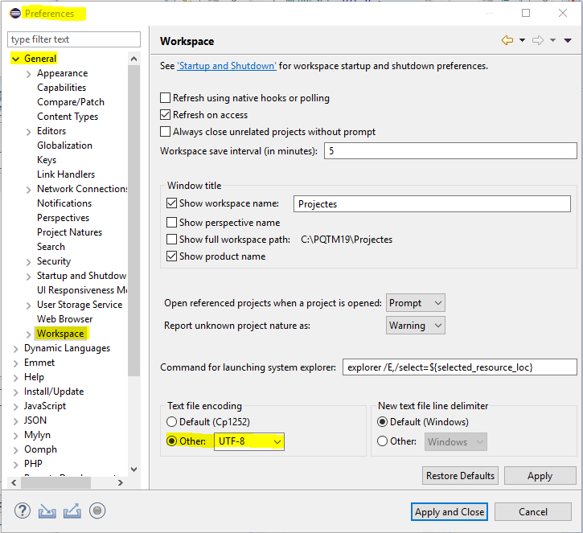

> 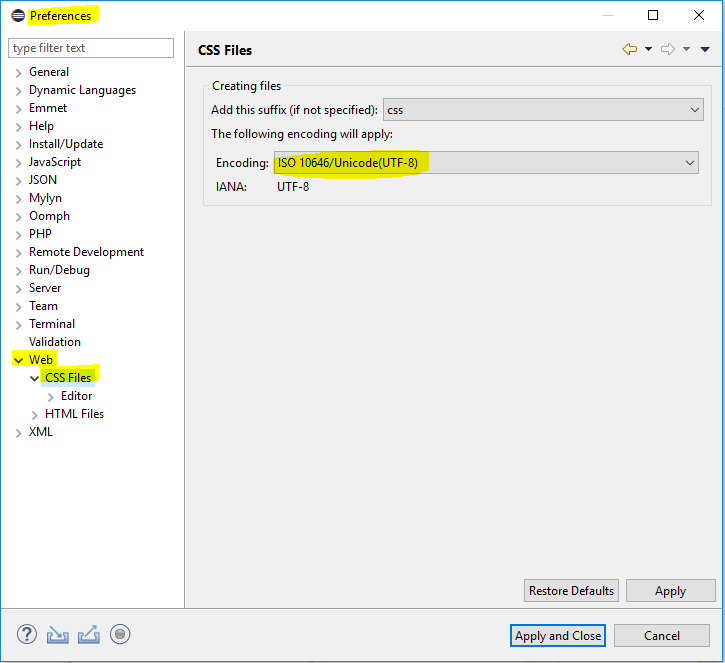

> 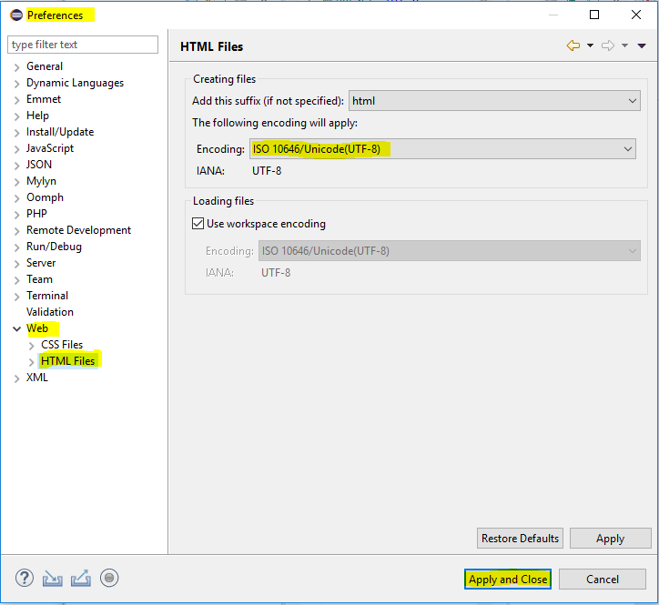

## 5. Definició de projecte
Definim un nou projecte a File/New/PHP Project. Per fer-ho, assegurar-se que estem a la vista (Prespective) adequada (fletxa vermella a la imatge).

> 

S'obre el quadre de diàleg i especifiquem el nom del projecte: pla1.pqtm.local

> 

> 

> 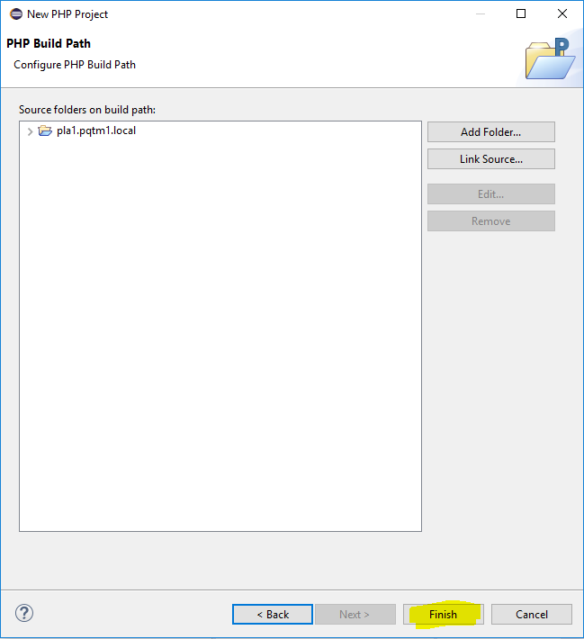

Comprovem que el projecte apareix en el nostre Workspace. Obrim el menú contextual del projecte i seleccionem "Properties".

> 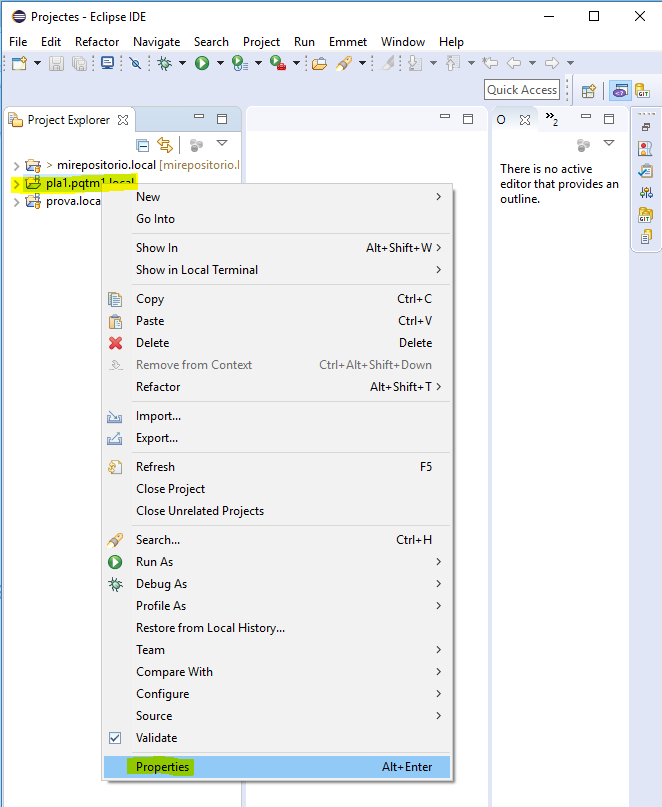

Comprovar que el charset es UTF-8 o, si no, el canviem a aquest mode:

> 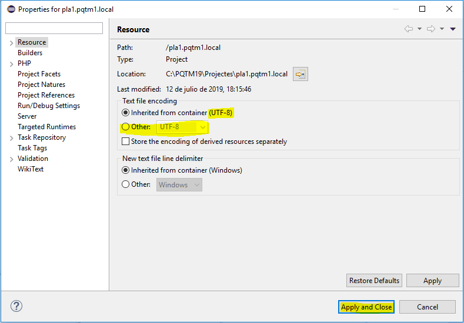

A continuació crear l'estructura bàsica de directoris del projecte. En el menú contextual (MC) del projecte seleccionar New/Other:

> 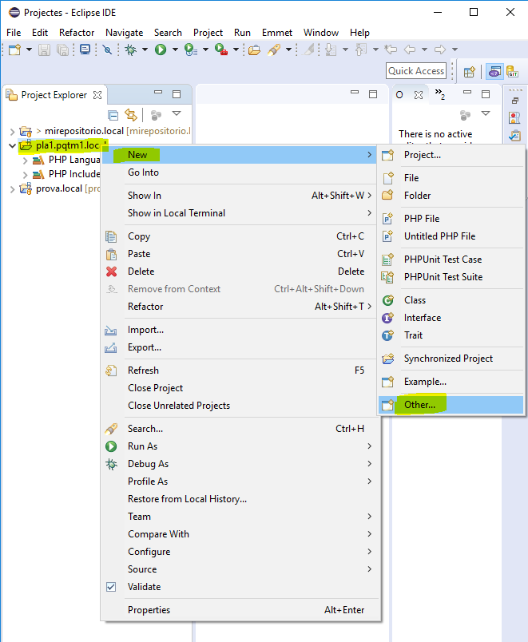

Crear una carpeta d'arxius css:

> 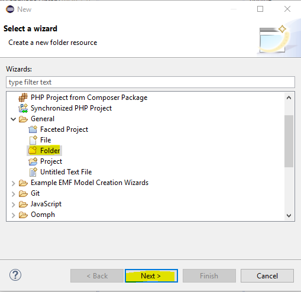

> 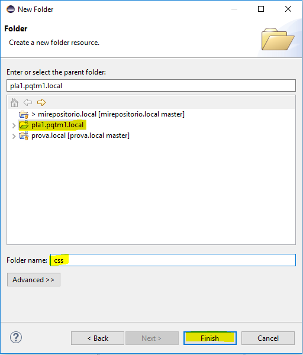

Amb el mateix procediment, crear carpeta d'arxius js, img, media. Obtenim la següent vista del projecte:

> 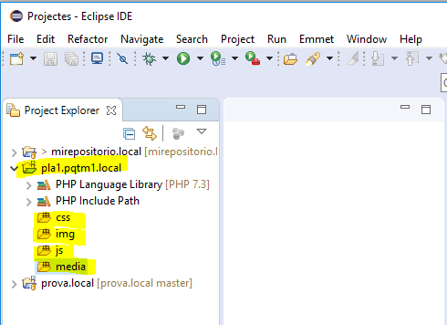

Crear un arxiu Index.html:

> 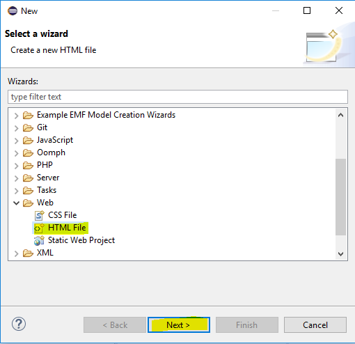

> 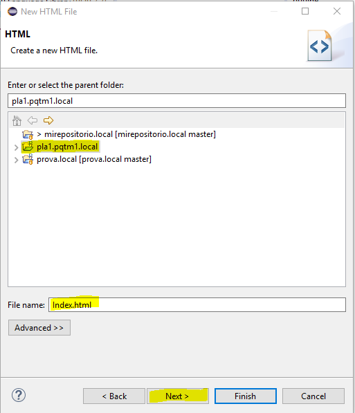

> 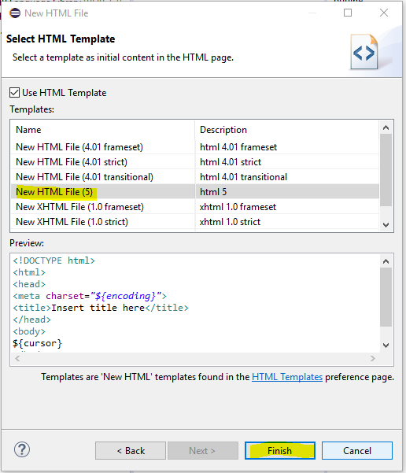

En el menú contextual (MC) del projecte seleccionar New/Other: Crear un archivo Estilos.css

> 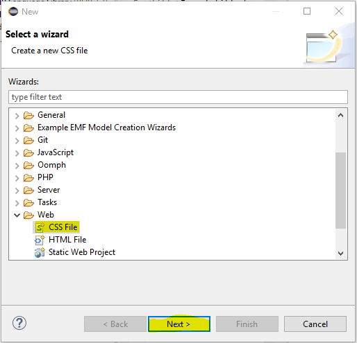

> 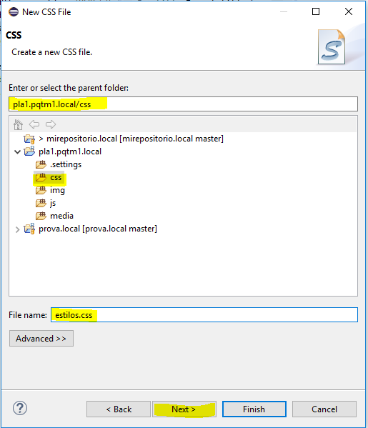

> 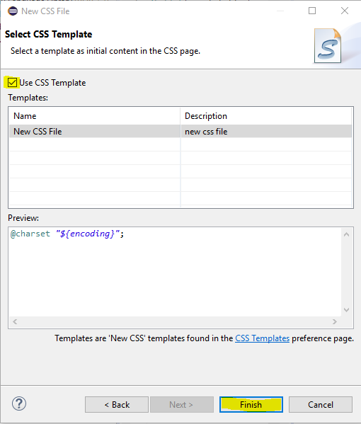

Obtenim la següent vista del projecte:

> 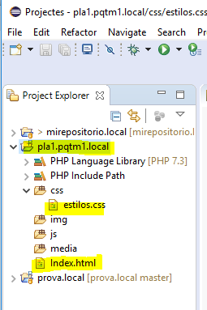

## 6. Definició del repositori local 

Per crear un repositori local, el primer pas es activar una nova vista (Perspective) del workspace. Seleccionar Window/Perspective/Other

> 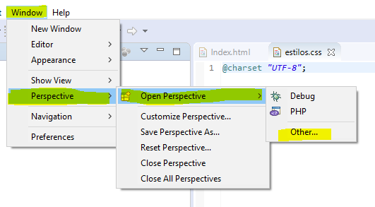

A la finestra seleccionem "Git":

> 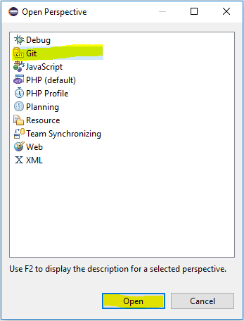

Aleshores en el workspace ens apareix una nova vista, que podem invocar sempre que desitgem prement la icona "GIT" de dalt a la dreta:

> 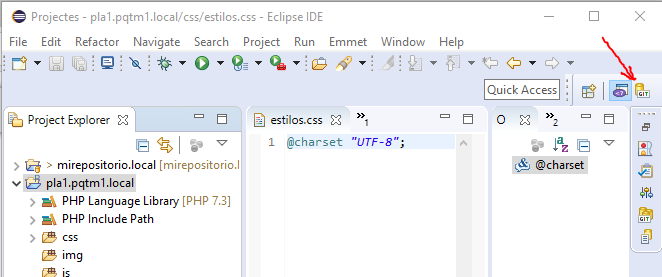

La imatge següent és un exemple de la vista del workspace amb aquesta perspectiva. Seleccionant la icona indicada amb fletxa vermella es pot crear un nou repositori local:

> 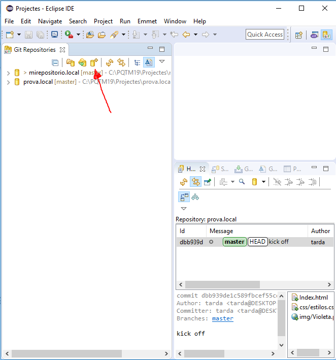

Al quadre de diàleg cal especificar el directori de projecte: C:\PQTM19\Projectes\pla1.pqtm19.local

> 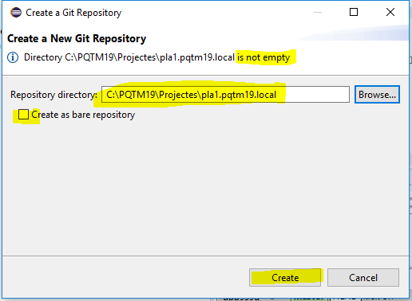

Com a resultat, apareix el nou repositori al workspace. Obrir el MC del nou repositori i seleccionar Commit, per crear una versió inicial del projecte en el repositori:

> 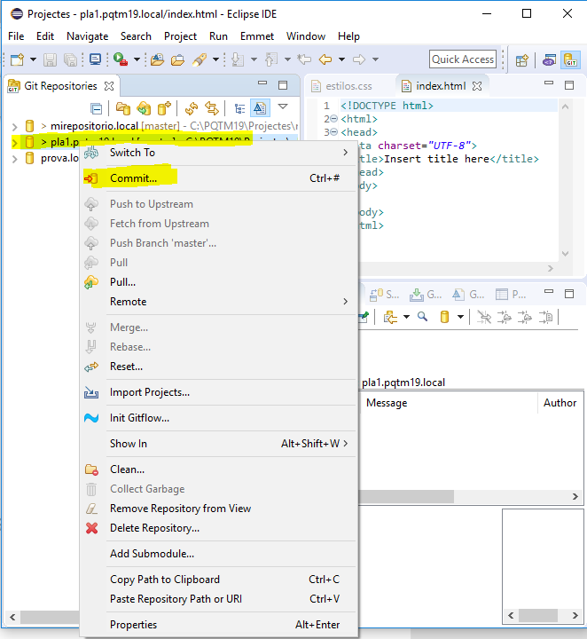

S'obre el quadre de diàleg del Commit:

> 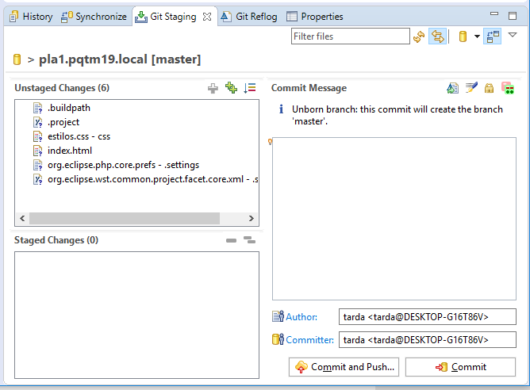

En aquest, cal especificar:
1. La descripció de la versió (Commit message). Per exemple: "Kick off version"
2. Els arxius nous en aquesta versió que han de ser guardats al repositori (cal passar-los a Staged changes). En ser la versió inicial, obviament, cal especificar tots els arxius del projecte. En aquest cas, estilos.css i index.html. Per incorporar-los a Staged Changes cal seleccionar-los i clicar en l'icona del signe de suma en color verd.
3. Ara bé, determinats arxius poden no formar part d'ell i cal no incorporar-los al repositori: especialment aquells que comencen per ".", que són arxius de control del Eclipse. Aquests arxius cal seleccionar-los i, amb el menú contextual, seleccionar "Ignore".

> 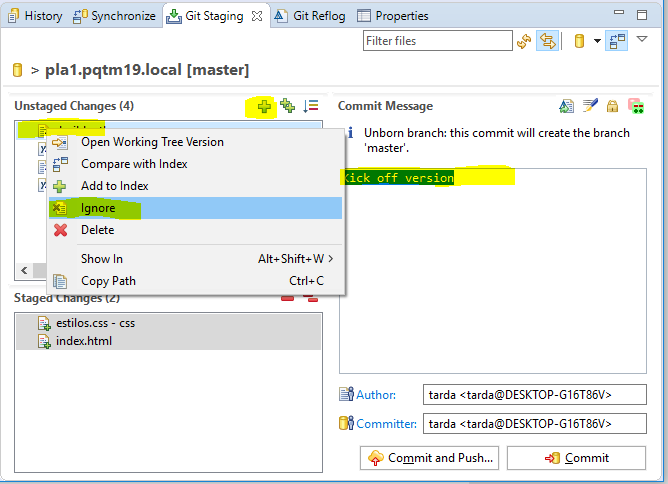

Un cop fet tot això, cal clicar "Commit" per carregar aquesta versió al repositori.

> 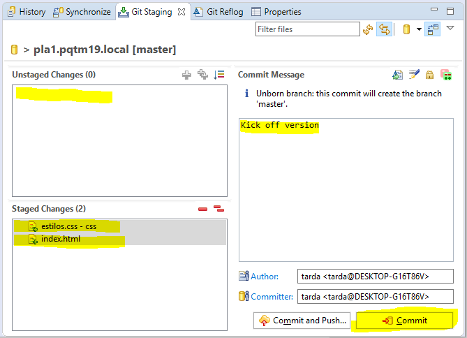
 
##7. Creació de Repositori de GitHub 

> 

##8. Exportació de la branca “master” local sobre repositori GitHub 

> 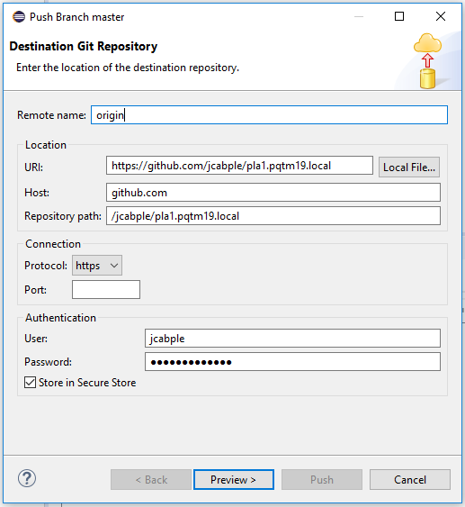

> 

> 
